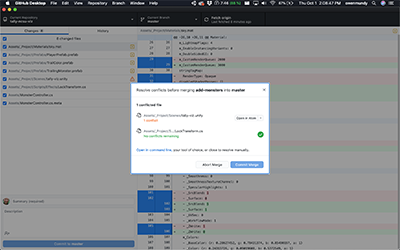
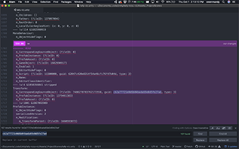

## Reference Sheet - Unity + Git


Presentations to review before setup
- [An introduction to version control with Unity](https://docs.google.com/presentation/d/1phoKp9d7BjhM0scs78rim6DtcUGoJAy4L31eDrR3zGE/edit#slide=id.g9b165dbc7b_0_0)
- [Git & Github Desktop](https://docs.google.com/presentation/d/1vtK6LoqwF4rQQZZy-ovuEgsYUwwMRXsqDVMOjAPSBt0/edit#slide=id.g9125938793_0_11)


## Setup

1. Use a Unity-specific [.gitignore](https://github.com/github/gitignore/blob/master/Unity.gitignore) and [.gitattributes](https://gist.github.com/FullStackForger/fe2b3da81e60337757fe82d74ebf7d7a) files (see this [article](https://thoughtbot.com/blog/how-to-git-with-unity) for info setting up)
1. Use visible .meta files and force assets to save as plain text: In Unity Project Settings > Version Control, set Mode = "Visible Meta Files"
1. Force assets to save as plain text: In Unity Project Settings > Editor > Asset Serialization, set Mode = "Force Text"
1. Enable [Git LFS](https://git-lfs.github.com/) (Large File Storage)
1. Enable SmartMerge to handle merging of scenes (see below)


## Workflow tips

- Use prefabs as much as possible to [prevent scene conflicts](https://medium.com/helloiconic/5-must-read-tips-to-use-git-with-unity-e8a308aa83a4).
- Work in separate branches, to ensure you don’t pollute the master branch
- Work in separate scenes as much as possible - YAML files are not pretty, readable, or organized 🙄 When you do work in the same scene avoid reorganizing assets. Use prefabs.
- Communicate often with your teammates; establish rules at the beginning.
- Try using https://unity.github.com/


## Dealing with issues
- Clear caches (local package cache, [global package cache](https://docs.unity3d.com/Manual/upm-cache.html)) in case of corrupted packages, and let Unity rebuild them the next time it resolves your dependencies.
- Clear the Library folder
- Delete your project's cache, located at <project path>/Library/PackageCache, to force the Package Manager to rebuild the caches and re-install them in your project.


## Setup SmartMerge

Unity comes with its own UnityYAMLMerge tool to make scene merges with Git go smoothly.

### Mac instructions

- Assumes you have Git, Unity Hub, Unity <version> installed and have followed the setup instructions above
- Windows-specific paths can be found [here](https://github.com/anacat/unity-mergetool)

```

# Download a fallback merge tool, for example diffmerge
brew cask install diffmerge

# edit .git/config file
nano .git/config

# ... and link to merge tool

[merge]
        tool = unityyamlmerge
[mergetool "unityyamlmerge"]
        trustExitCode = false
        cmd = '/Applications/Unity/Hub/Editor/2020.1.2f1/Unity.app/Contents/Tools/UnityYAMLMerge' merge -p "$BASE" "$REMOTE" "$LOCAL" "$MERGED"

```

Now, whenever you merge or rebase and a conflict appears, instead of manually fixing, open Git Shell/Bash and type the following command:
```
git mergetool
```
The tool will then resolve those conflicts for you automatically. If you don't have a fallback tool, you'll just get a message stating this, but you'll still be able to resolve the conflitcs in your editor. Then to run `git add .` in order to save the changes made, and then `git rebase --continue` when rebasing or `git merge --continue` when merging.


### You can also do this with Github Desktop / Atom

1. Switch into the branch and test that everything works
1. Switch back to master branch and choose Branch > Merge into current branch ...
1. Select the branch you want and SmartMerge should take care of everything
1. If SmartMerge finds issues it will [prompt](images/git-resolve-yaml-desktop.png) you to open the default editor used to resolve the conflicts (in my case, Atom).
1. Open each file in [Atom and scroll to select which conflicting text to keep]((images/git-resolve-yaml-atom.png))
1. Choose [Commit Merge](images/git-resolve-yaml-desktop.png) when finished

[](images/git-resolve-yaml-desktop.png)
[](images/git-resolve-yaml-atom.png)


#### References

- Unity Manual: [SmartMerge](https://docs.unity3d.com/Manual/SmartMerge.html)
- [anacat/unity-mergetool](https://github.com/anacat/unity-mergetool)


#### Notes on other methods 

(Perforce, which provides more automation but looks like a serious pain to set up)

- [Unity Forum thread](https://forum.unity.com/threads/smart-merge-not-working.315903/) (dead?) and [Reddit Thread](https://www.reddit.com/r/Unity3D/comments/39bdq5/how_to_solve_scene_conflicts_with_unitys_smart/)
- The [Perforce installation instructions](https://www.perforce.com/video-tutorials/vcs/installing-and-configuring-p4connect-unity) mention "P4Connect" connect on the asset store 
but it [does not exist](https://assetstore.unity.com/?q=P4Connect&orderBy=1)
- Perforce and P4V seem extra complicated to setup, with the only benefit a GUI to complete the merging. They are available on homebrew using `brew cask install p4v` and `brew cask install perforce`


## References

- [Unity Best Practices](https://github.com/jaayap/Unity_Best_Practices/blob/master/En/Versioning.md/#versioning--git--unity)
- Github Documentation: [Installing Git Large File Storage
](https://docs.github.com/en/free-pro-team@latest/github/managing-large-files/installing-git-large-file-storage))
- [How to Git with Unity](https://thoughtbot.com/blog/how-to-git-with-unity)


