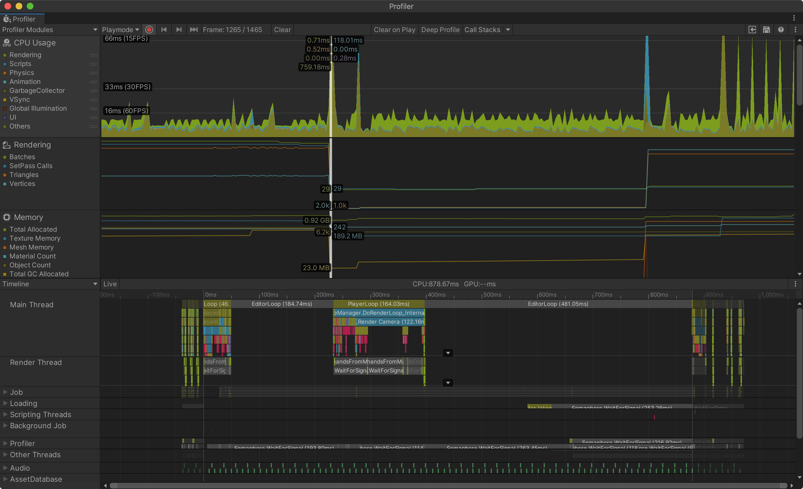

## Reference Sheet - Unity Performance

Increasing performance in your game means lowering the work required by the CPU, GPU, and network.

- The easiest test is to leave the Stats window open in the Game View while you are building. This will quickly allow you to judge one of the most important performance metrics, Frame Per Second (FPS).
- You should also [regularly check](https://www.youtube.com/watch?v=fROTtgZK-Zs) the [Profiler Window](https://docs.unity3d.com/Manual/ProfilerWindow.html) to look for (and deal with) obvious spikes in  so you are aware of any issues in your project. More performance terms, tips, and resources are listed below.

### C# Terminology

Term | Definition
--- | ---
Garbage | Memory that has been set aside to store data but is no longer in use.  When you remove objects from your game their data is no longer needed. The memory that stored that data is then freed to be reused.
Garbage Collection | The process that makes previously used memory available again for reuse. Garbage Collection can cause big performance problems if not properly handled.
Object Pooling | A process where you pre-instantiate all objects you’ll need at any specific moment before gameplay — for instance, during a loading screen. Instead of creating new objects and destroying old ones during gameplay, your game reuses objects from a “pool”.
Draw calls | Each command the CPU sends to your GPU to draw geometry on your screen; Effectively, the number of objects being drawn. Keep this number down (<2000 desktop and <200 mobile) to maintain good performance.

## General Performance Tips

The following sections address specific areas for considering performance, starting with this general section.

1. Changes in one "performance area" can affect others, so test everything as you make each improvement.
1. When you need a reference to a component, camera, or script, do so in `Awake()` or `Start()` and store the reference in a variable accessible by the entire class. This will improve performance because you won't have to look up the same reference over and over in `Update()`.
1. Use Object Pooling [Object Pooling in Unity](https://www.raywenderlich.com/847-object-pooling-in-unity) to decrease the overhead in instantiating and destroying lots of GameObjects.

## Graphics Performance

- Use [spritesheets (a.k.a. texture atlas) to group similar bitmap images](images/draw-calls-sprite-sheet.png) and reduce the draw calls to your GPU
- Ensure you use pixel resolutions that are Power of 2 (128,256,512,1024, etc.) which can be compressed better.

#### More Graphics Tips

- Unity Manual: [Mobile Optimization](https://docs.unity3d.com/Manual/MobileOptimisation.html)
- Unity Manual: [Optimizing graphics performance](https://docs.unity3d.com/Manual/OptimizingGraphicsPerformance.html)
- [Unity CPU Optimization: Is Your Game… Draw Call Bound?](https://www.gamasutra.com/blogs/RubenTorresBonet/20200513/362872/Unity_CPU_Optimization_Is_Your_Game_Draw_Call_Bound.php) (2020)

## Garbage Collection

- [Unity Tips - Garbage Collection](https://danielilett.com/2019-08-05-unity-tips-1-garbage-collection/), 2019
- Unity Manual: [Understanding Automatic Memory Management](https://docs.unity3d.com/Manual/UnderstandingAutomaticMemoryManagement.html)
    - Don't concat strings in loops or `Update()`.
- Unity Tutorial: [Optimizing garbage collection in Unity games](https://unity3d.com/learn/tutorials/topics/performance-optimization/optimizing-garbage-collection-unity-games)

## Networks, Bandwidth, and Handling Data

- [5 Common Misuses of Collections](https://www.jacksondunstan.com/articles/5145)

## Optimizing Unity UI

To understand UI performance start with this video from Unite Europe 2017: [Squeezing Unity: Tips for raising performance
](https://www.youtube.com/watch?v=_wxitgdx-UI&index=7&list=PLX2vGYjWbI0Rzo8D-vUCFVb_hHGxXWd9j&ab_channel=Unity)

From the video, the first thing to know is that during runtime, if you [change even one component that needs to be redrawn it sets a "dirty" flag on the entire Canvas (the first parent technically) of that changed object](https://youtu.be/_wxitgdx-UI?t=1648). When a Canvas is marked dirty then **ALL** the geometries in that Canvas need to be recomputed [on that frame](https://docs.unity3d.com/Manual/ExecutionOrder.html) causing a major performance hit. Several of the tips below help to address this issue.

#### UI Tips

- Organize your UI elements into multiple or nested canvases based on when they are updated. These "islands" will [help to isolate elements into groups that should be redrawn together](https://youtu.be/_wxitgdx-UI?t=1680) so you won't have to redraw all elements across your UI.
- Use prefabs to nest elements [#20](https://medium.com/@dariarodionovano/unity-ui-best-practices-40964a7a9aba)
- [Disable the Raycast Target property for all non-interactive elements](https://medium.com/@dariarodionovano/unity-ui-best-practices-40964a7a9aba) to avoid [the amount of work the raycaster must do on each frame](https://youtu.be/_wxitgdx-UI?t=1944)
- Turn off Images components you don't need to avoid draw calls [#15](https://medium.com/@dariarodionovano/unity-ui-best-practices-40964a7a9aba)
- [Do not use alpha to show / hide elements](https://medium.com/@dariarodionovano/unity-ui-best-practices-40964a7a9aba)
- Be careful using `Canvas.ForceUpdateCanvases()` because there is a serious performance hit.

### UI performance resources

- Unity Tutorial: [Optimizing Unity UI](https://learn.unity.com/tutorial/optimizing-unity-ui#5c7f8528edbc2a002053b5a0)
- Unity Create: [Some of the best optimization tips for Unity UI](https://create.unity3d.com/Unity-UI-optimization-tips)
- [Unity UI Best Practices](https://medium.com/@dariarodionovano/unity-ui-best-practices-40964a7a9aba)

### Other Tips

- Know how the camera frustrum and clipping planes work https://docs.unity3d.com/Manual/UnderstandingFrustum.html
- Did you bake lighting?
- Did you bake your fonts ([change from dynamic to static](https://youtu.be/NY1xKqCIj3c?t=849))
- Consider the [Order of Execution for Event Functions](https://docs.unity3d.com/Manual/ExecutionOrder.html) and make sure you aren't causing extra work.

### Sources
- [Unity Scripting Reference](https://docs.unity3d.com/ScriptReference/index.html)
- Chapter 8 in Halpern, Jared. Developing 2D Games with Unity. APress, 2019.
